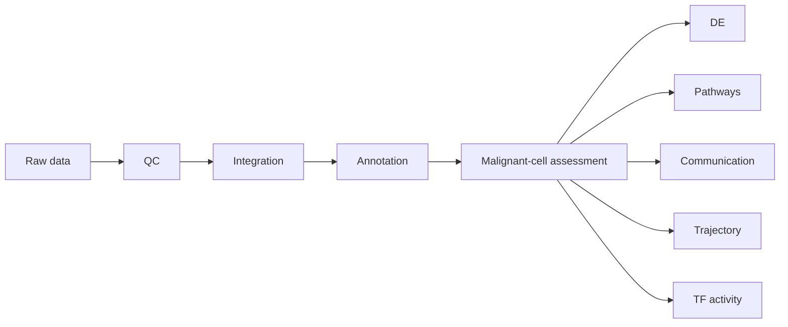
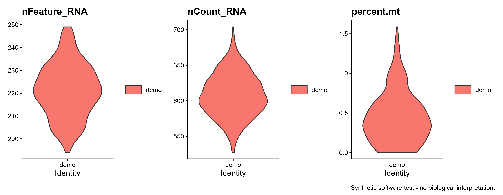
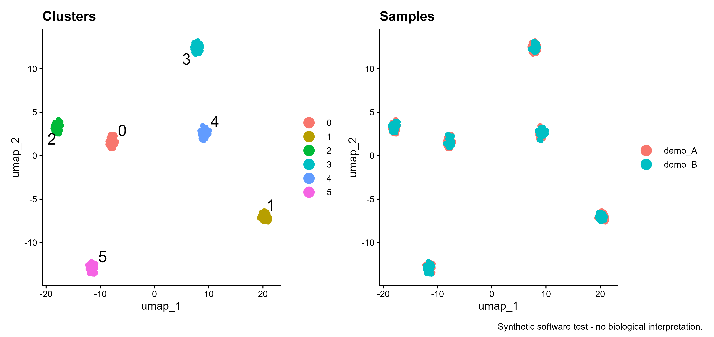
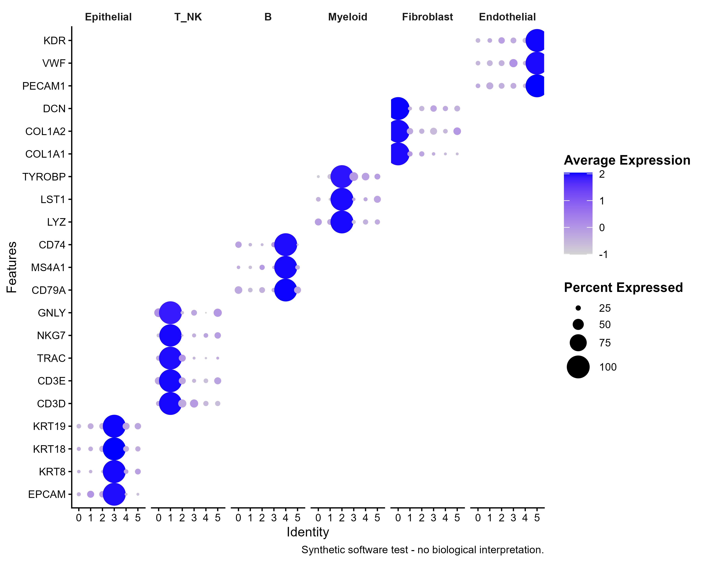

# TumorSC-Workflow

**A reproducible single-cell RNA-seq workflow for tumor microenvironment analysis and cancer research**


TumorSC-Workflow is a transparent, configuration-driven R/Seurat analysis
template for tumor single-cell RNA-seq. It is a research workflow—not a new
algorithm—and makes no claims of benchmark superiority, clinical validity, or
novel biological discovery.

## Overview

The repository separates stable analysis logic from study-specific decisions.
QC thresholds, preprocessing choices, batch variables, marker panels, contrasts,
and optional modules are configured in one YAML file. Annotation and malignant-
cell identification deliberately preserve the need for biological review.



Editable workflow source: [`docs/workflow.md`](docs/workflow.md).

### Why tumor-specific?

Tumor datasets require decisions that generic PBMC tutorials often omit:
distinguishing malignant from non-malignant epithelial cells, selecting suitable
CNV reference populations, retaining patient/sample structure, and interpreting
immune, stromal, and tumor states together. This workflow makes those decisions
visible instead of hiding them behind a single automatic label.

### Why reproducibility?

Thresholds and analysis choices are centralized in `config/config.yaml`; scripts
have explicit input/output contracts; random seeds, tables, figures, objects, and
`sessionInfo()` are recorded. The goal is to make it possible to audit what was
run, with which parameters, and in which software environment.

### What requires biological review?

QC thresholds, batch-correction strategy, cluster resolution, cell labels,
malignant-cell evidence, DE contrasts, reference cells, trajectory start states,
and the interpretation of pathway, communication, pseudotime, and TF scores all
remain study-specific decisions. The workflow provides reproducible machinery;
it does not replace biological judgment.

## Features

- Configurable QC, `LogNormalize` or `SCTransform`, and variable-feature selection
- PCA, optional Harmony batch correction, clustering, and UMAP
- Two-level marker-informed annotation with DotPlot and FeaturePlot review
- Candidate malignant epithelial-cell evidence framework with inferCNV/CopyKAT result interfaces
- Differential expression, volcano plots, heatmaps, and CSV export
- Hallmark GSEA and AddModuleScore/UCell pathway scoring
- Optional CellChat, Slingshot, and decoupleR/DoRothEA modules
- Consistent PDF, editable SVG, and 600-dpi PNG output
- Script-level `sessionInfo()` logs and a synthetic software smoke test

## Installation

Requirements: R >= 4.3 is recommended; package compatibility should be captured
with `renv` on the machine where the workflow is run.

```bash
git clone https://github.com/YOUR-USERNAME/TumorSC-Workflow.git
cd TumorSC-Workflow
Rscript environment/install_packages.R --core
```

Optional modules have additional dependencies: Harmony (`harmony`), CellChat,
Slingshot, decoupleR/DoRothEA, inferCNV, or CopyKAT. Install only the modules you
intend to use, following each tool's current official instructions, then create
an `renv.lock` as described in [`environment/README.md`](environment/README.md).

## Quick Start

### 1. Run the synthetic smoke test

The default configuration creates a small synthetic count matrix with six
deliberately injected latent profiles. It tests clustering, marker visualization,
and multi-group DE code paths only; it contains no valid tumor biology.

```bash
Rscript scripts/00_Generate_Synthetic_Demo.R
Rscript scripts/01_QC_Preprocessing.R
Rscript scripts/02_Integration_Clustering.R
Rscript scripts/03_Cell_Annotation.R
Rscript scripts/04_Malignant_Cell_Identification.R
Rscript scripts/05_Differential_Expression.R
```

Because no manual cluster map is supplied, the demo deliberately retains
`Unreviewed_cluster_*` labels. Optional modules are disabled by default.

### 2. Use real public data

1. Place one 10x filtered matrix directory per sample under `data/raw/`.
2. Edit `data/sample_metadata.csv` with `sample_id`, `path`, and study metadata.
3. Set `project.input_mode: 10x_directory` in `config/config.yaml`.
4. Review QC settings and choose `integration.method: harmony` for batch-aware
   integration (after installing Harmony), or `none` when integration is not
   scientifically warranted.
5. Run scripts in numerical order.
6. Inspect marker plots, then fill `level1_map` and `level2_map` in
   `scripts/03_Cell_Annotation.R`; rerun downstream scripts.
7. Define an explicit DE contrast before running pathway enrichment.

For a Seurat RDS, set `project.input_mode: rds` and point
`project.input_path` to a project-relative file.

## Repository Structure

```text
TumorSC-Workflow/
├── config/config.yaml             # Central analysis parameters
├── data/                          # Input contract; raw data ignored by Git
├── docs/                          # Workflow and interpretation guidance
├── environment/                   # Dependency installer and renv guidance
├── functions/                     # Shared I/O, validation, and plotting helpers
├── results/                       # Generated objects, tables, figures, logs
├── scripts/00...09                # Ordered analysis modules
├── run_pipeline.R                 # Core synthetic pipeline convenience runner
└── README.md
```

## Analysis Modules

| Script | Main output | Status in this repository |
|---|---|---|
| `00_Generate_Synthetic_Demo.R` | Synthetic Seurat object | **Tested / executed**; software fixture only |
| `01_QC_Preprocessing.R` | Filtered, normalized object | **Tested / executed** |
| `02_Integration_Clustering.R` | PCA/clusters/UMAP | **Tested / executed** with `integration.method: none`; Harmony not tested |
| `03_Cell_Annotation.R` | Marker plots and two-level label framework | **Tested / executed**; manual mapping intentionally not supplied |
| `04_Malignant_Cell_Identification.R` | Candidate evidence table | **Tested / executed**; no candidate call without reviewed epithelial labels; CNV import not tested |
| `05_Differential_Expression.R` | DE tables and plots | **Tested / executed** on six synthetic clusters |
| `06_Pathway_Enrichment.R` | Hallmark GSEA and scores | Implemented but not locally validated |
| `07_Cell_Cell_Communication.R` | CellChat predictions | Optional interface |
| `08_Trajectory_Analysis.R` | Slingshot lineages, weights, pseudotime, curves, gene trends | Implemented, not locally executed |
| `09_TF_Activity.R` | DoRothEA/decoupleR activities, rankings, matrices, plots | Implemented, not locally executed |

“Implemented” means code is present; it does not by itself mean that every
module has been executed on every platform or validated for a particular study.
See **Validation status** below.

## Malignant-cell Identification

The workflow follows an evidence-integration model:

```text
Epithelial cells
    ↓
CNV inference + tumor-associated marker context + reference-cell quality
    ↓
Candidate malignant epithelial cells
```

CNV-based inference should be interpreted together with biological context and
appropriate reference cells. inferCNV and CopyKAT results can be imported as an
evidence column; neither method is presented as absolute malignant-cell ground
truth.

## Example Output

All figures below are labeled **Synthetic software test - no biological
interpretation.** They demonstrate file generation and visual conventions only.

| QC output | Clustering and sample mixing |
|---|---|
|  |  |



### Future public tumor dataset demo

A future real-data section should report: dataset accession and license; sample
and patient counts; tissue/disease context; download and preprocessing steps;
QC inclusion/exclusion counts; batch and donor handling; reviewed annotation
evidence; and a clear distinction between demonstration outputs and claims that
would require independent biological validation. No large dataset is downloaded
automatically by this repository.

## Reproducibility

- Random seed is centralized in `config/config.yaml`.
- Scripts use project-relative paths via `here`.
- Every module writes `sessionInfo()` to `results/logs/`.
- Generated data, objects, and figures are ignored by Git by default.
- After a successful local run, create and commit a verified `renv.lock`.
- Sample/patient structure must be considered when choosing statistical tests;
  treating cells as independent biological replicates can inflate confidence.

## Validation Status

Tested environment (local synthetic smoke test):

| Component | Version |
|---|---|
| Operating system | Windows 11 x64 (build 26200) |
| R | 4.6.1 (2026-06-24 ucrt) |
| Seurat | 5.5.1 |
| SeuratObject | 5.4.0 |
| Matrix | 1.7-5 |
| ggplot2 | 4.0.3 |

Scripts 00-05 completed from raw synthetic count generation through six-cluster
differential-expression output (238 marker rows). All 240 synthetic cells passed
the configured QC fixture. This verifies the tested software path, not biological
validity, real-tumor performance, or annotation accuracy.

The exact validation record and session information are stored in
[`docs/validation/phase2_core_run.md`](docs/validation/phase2_core_run.md) and
[`docs/validation/phase2_sessionInfo.txt`](docs/validation/phase2_sessionInfo.txt).
Modules 06-09, Harmony, CNV import, CellChat, Slingshot, decoupleR/DoRothEA,
inferCNV, and CopyKAT were not locally executed in this phase.

## Limitations

- Annotation depends on tissue biology, data quality, marker specificity, and
  expert review; there is no universal automatic annotation result.
- Malignant-cell identification requires careful interpretation and suitable
  non-malignant reference cells.
- Ligand-receptor inference represents computationally predicted communication
  potential rather than direct experimental evidence.
- Pseudotime does not itself establish temporal progression or causality.
- TF activity is a regulon-based computational inference, not direct biochemical proof.
- Default cell-level DE is exploratory; donor-aware pseudobulk or mixed models
  may be required for cohort-level inference.

## Citation

This workflow has no associated publication. If you use or adapt it, please
cite the underlying tools used in the corresponding analysis modules.

## Author

**Zhao Yanlong**

Research interests: Tumor Immunology · Cancer Biology · Single-cell Genomics ·
Computational Biology

## License

MIT License. See [`LICENSE`](LICENSE).
