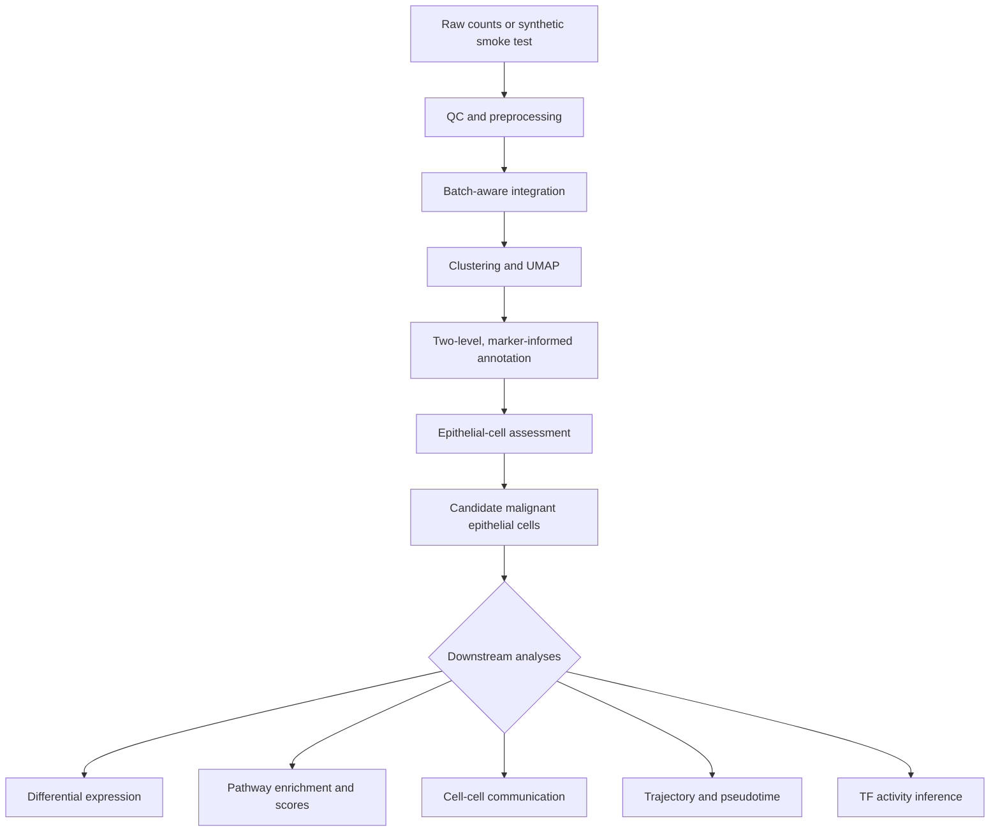

# Workflow diagram

The diagram is stored as Mermaid source so changes remain reviewable in Git.

CNV inference is an optional evidence layer between epithelial-cell assessment
and candidate classification. It requires appropriate reference cells and
biological interpretation.

